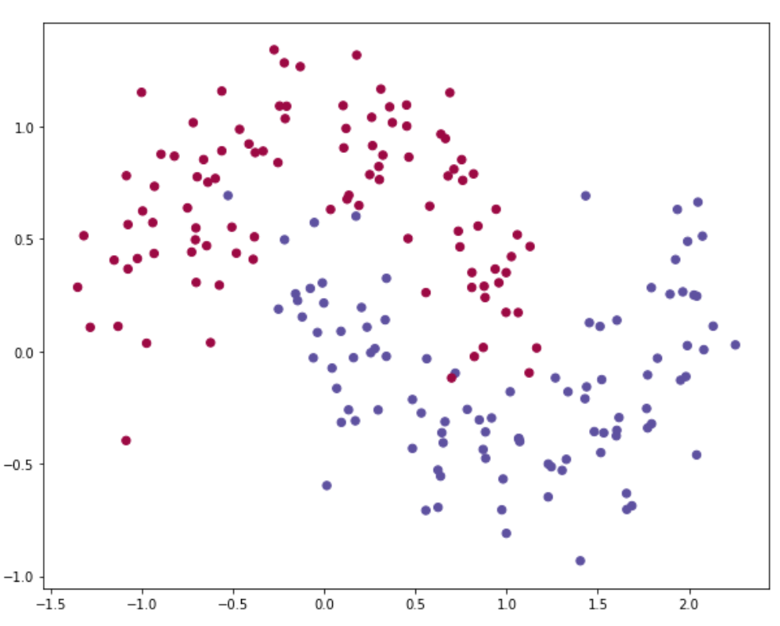
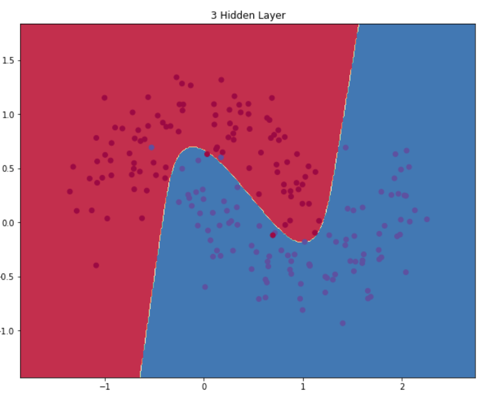
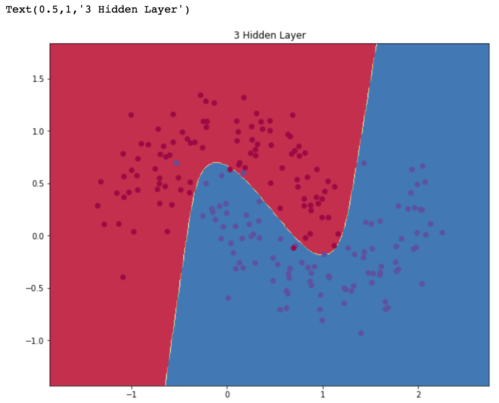

# 神经网络

516030910412 王见思

## 一、环境与依赖
- Python 3.6
- Numpy
- Pandas
- matplotlib
- sklearn
    - <b>神经网络部分并未使用 sklearn</b>，仅仅使用了以下功能
    - sklearn.dataset
        - 最初使用了 scikit learn 的数据集，并使用 matplotlib 做了可视化，验证神经网络的正确性。 最后也使用了 UCI 的 Iris 数据集。
    - sklearn.processing
        - 使用 sklearn.processing.scale 做 z-score 标准化

## 二、功能实现

基础功能全部实现。

Bonus：

- [ ] 隐藏层可变
- [x] 隐层节点数可变
- [x] 激活函数可选
- [x] 数据为矩阵
- [x] 输入层维度可变
- [x] 输出层维度可变
- [x] 使用 UCI ML Repository 的数据集

## 三、模型质量

使用了两个数据集来验证模型，考虑是分类问题，选择交叉熵作为损失函数。激活函数可选。

1. sklearn.datasets.make_moons(200, noise=0.20)
- 数据集预览
  
    
    
- 训练结果(选择 tanh 激活函数，迭代20000次)

    

1. UCI - [Iris](https://archive.ics.uci.edu/ml/datasets/Iris) 
- 数据集预览(after shuffle)
  
| No | sepal length | sepal width | petal length | petal width | class |
|----|--------------|-------------|--------------|-------------|-------|
| 0 | 4.6 | 3.4 | 1.4 | 0.3 | Iris-setosa |
| 1 | 6.9 | 3.1 | 4.9 | 1.5 | Iris-versicolor |
| 2 | 5.7 | 2.6 | 3.5 | 1.0 | Iris-versicolor |
| 3 | 4.8 | 3.0 | 1.4 | 0.3 | Iris-setosa |
| ... | ... | ... | ... | ... | ... |

- 训练结果（选择 sigmoid 激活函数，迭代500次）
    - 训练集 100 条；测试集 50 条
    - Accuracy: 96.00%

## 四、函数说明
- Utility Functions: 激活函数与 Softmax
    - _tanh(x)
    - _ReLU(x)
    - _sigmoid(x)
    - _softmax(x)

- Class NNmodel
    - Function: \_\_init\_\_
        - Usage: 初始化模型
        - Parameter:
            - X: 数据集的 features
            - y: 数据集的 labels
            - inputDim: 输入层维数
                - default: 2
            - outputDim: 输出层维数
                - default: 2
            - epsilon: 学习率
                - default: 0.01
            - regLambda: 正则项
                - default: 0.01
        - Example:

            ``` python
            X=[[1,2,3],[2,3,4],[3,4,5]]
            y=[0,1,2]
            # feature [1,2,3] 对应的 label 即为 0；feature [2,3,4] 对应的 label 即为 1
            model = NNmodel(X, y, inputDim=3, outputDim=3)
            ```
    - Function: activate
        - Usage: 根据 `self.activation` 选择对应激活函数
        - Parameter: 
            - X: 输入值
        - Example:

            ``` python
            a1 = self.activate(z1)
            ```
    - Function: get_parameter
        - Usage: 获取模型参数
        - Parameter:
            - None
        - Example:

            ``` python
            W1, b1, W2, b2 = self.get_parameter()
            ```
    - Function: cross_entropy:
        - Usage: 使用交叉熵作为损失函数
        - Parameter:
            - None
        - Example:

            ``` pyhon
            loss = self.cross_entropy()
            ```
    - Function: predict
        - Usage: 使用当前模型预测结果
        - Parameter:
            - x: 数据的 features
        - Example:

            ``` python
            result = model.predict(x)
            ```
    - Function: build_model
        - Usage: 训练神经网络模型
        - Parameter:
            - hiddenDim: 隐藏层维数
            - passes: 迭代次数
                - default: 20000
            - print_loss: 是否打印 acc 和 loss
                - default: False
            - activation: 激活函数
                - default: "tanh"
        - Example:
            
            ``` python
            model.build_model(5, activation="sigmoid")
            ```
- Function: plot_decision_boundary
    - Usage: 画出模型分类结果的分界线
    - Parameter: 
        - X: 数据集的 features
        - y: 数据集的 labels
        - pred_func: 预测函数
    - Example:

        ``` python
        model = NNmodel(X, y, inputDim=2, outputDim=2)
        model.build_model(3, print_loss=False,activation="sigmoid")
        plot_decision_boundary(X, y, lambda x: model.predict(x))
        plt.title("3 Hidden Layer")
        ```

        